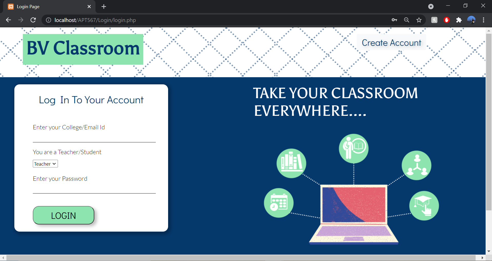
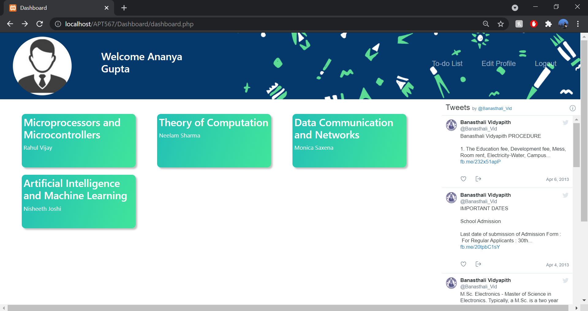
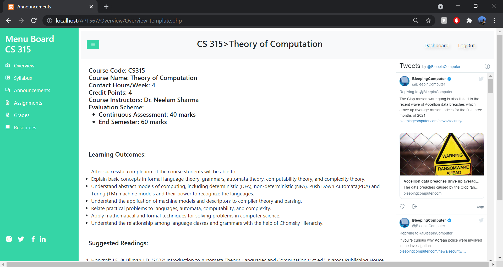
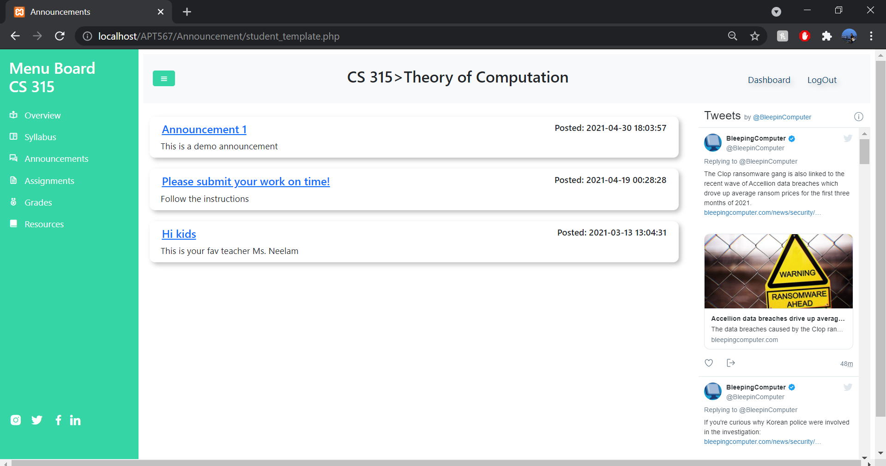

<div align="center">

</div>


## Welcome to BV CLASSROOM!
Our project is an Learning Management Portal which will help the universities and the schools to conduct online education efficiently in this COVID Era. It will help teachers and students have their courses, and the required material at one place.
We will  give the facility to teachers to add the announcements, assignments, grades and resources of respective courses and students with the facility to access the same. Students can also submit their answer sheets on the portal. Furthermore, a to-do list feature is provided for the students to help keep a check on their due assignments.

## Objective :-
• Serving with best possible quality.
• Customized and attentive approach to individual students.
• Making Faculty and Student learning management process more efficient as compared to traditional Google Meets/Zoom Calls.
• More flexibility for Teachers
• Structured environment to manage responsibilities
## Technologies used
<p>●      Database: MySQL</p>
<p>●      Frontend: HTML, CSS and Bootstrap</p>
<p>●      Server: Xampp and PHP</p>


## List of Tables:

- Login_info: Stores the login information of both, the faculty and students(Login_ID, Email, password, Type)

- Student_info: Stores basic student information (S_ID, Name, Email, Profile Picture, Class ID)

- Faculty_info: Stores basic facultyinformation (F_ID, Name, Email, Profile Picture)

- Class_info: Stores information about all unique class/sections(Class_ID, Semester, Branch, Section)

- Course_info: Stores information about all courses taught in the instituition(Course_ID, Name, Credits, Syllabus, Overview)

- Class_course: Links the courses to each class with their faculties(Class_ID, Course_ID, F_ID)

- Question_paper_type: Stores information about the different types of examinations conducted(QP_ID, QP_name, QP_max_marks)

- Question_paper_info: Stores the details about each question paper which is assigned to a particular classroom(Class_ID, Course_ID, QP_ID, QP_date, QP_link, QP_due_date)

- Submit_info: Stores the submission details(answer sheet details) for eahc student in regards to the question paper(Sub_ID, S_ID, Course_ID, QP_ID, Sub_date, Sub_link, Sub_marks)

- Resources_info: Stores the details of all study materials uploaded for a course in a class(Res_ID, Course_ID, Class_ID, Res_title, Res_week, Res_link)

- Announcements_info: Stores the details of the announcements uploaded for a course in a class(Ann_ID, Course_ID, Class_ID, Ann_date, Ann_title, Ann_desc)


## Screenshots & Gif

These are the screenshots of our work -

<!-- <p> -->
  
  
  
<!-- </p> -->

<!-- <p> -->
  
  
  
<!-- </p> -->

<!-- <p> -->
  
  
  
<!-- </p> -->

## Getting Started
Instructions on setting up your project locally.

### Prerequisites
Install XAMPP 
 

### Installation
1. Clone the repo
   ```sh
   git clone https://github.com/priithaa/APT567.git
   ```
2. Import database(sql file) to PHPMYADMIN

### If you like our work please give us a :star: :blush:

