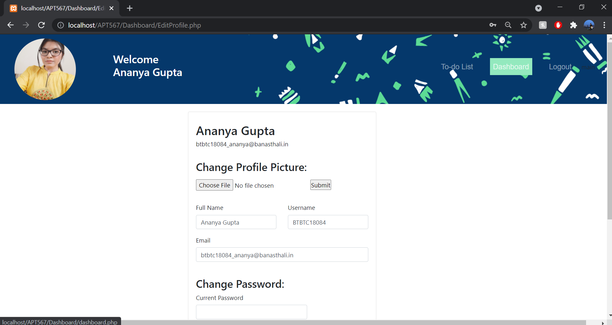
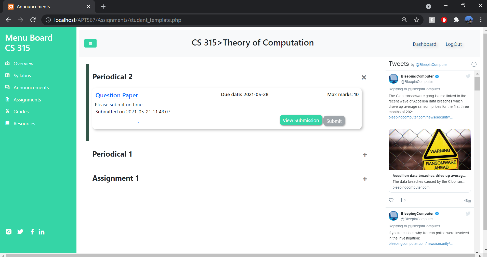
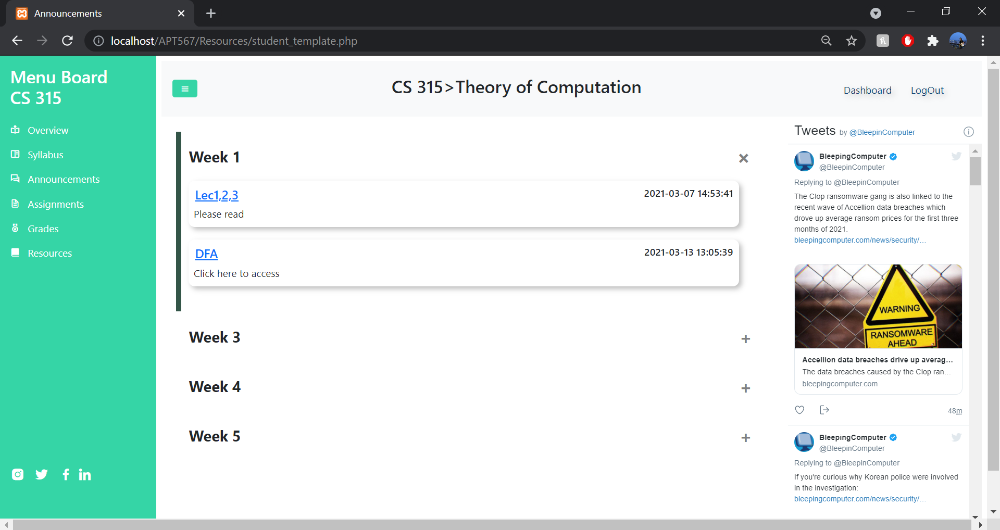

## Welcome to BV CLASSROOM!
Our project is an Academic Portal which will help the universities and the schools to conduct online education efficiently. It will help teachers and students have their courses, and the required material at one place.
We will  give the facility to teachers to add the announcements, assignments, grades and resources of respective courses and students with the facility to access the same. Students can also submit their answer sheets on the portal. Furthermore, a to-do list feature is provided for the students to help keep a check on their due assignments.

## Technologies used

●      Database: MySQL

●      Frontend: HTML, CSS and Bootstrap

●      Server: Xampp and PHP

## Screenshots & Gif

These are the screenshots of our work -

<!-- 
 -->
  
  
  
<!-- 
 -->

<!-- 
 -->
  
  
  
<!-- 
 -->

<!-- 
 -->
  
  
  
<!-- 
 -->

### If you like our work please give us a :star: :blush:

